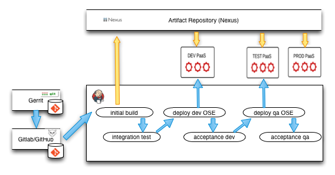

# Continuous Delivery with JBoss Fuse and OpenShift
This project is a example of an end-to-end [Continuous Delivery][cd] automation pipeline for JBoss Fuse integration projects. 

This can be used to set up a handful of tools to assist your team to work cross functionally in a DevOps culture. 
The same philosophy and pipeline can be used for other types of applications as well, but with
JBoss Fuse, we can focus on integration projects and [Micorservices][microservices]. The demo focuses on automating
the developer experience (using Git, for example) as well as automating the deployment enlivenment (using
[OpenShift][openshift] for example). The project can be used as a starting point for a customizable CD solution.

There are two angles to this project. One is actually using (ie, all set up and ready to demo)it to do continuous delivery 
on JBoss Fuse, and the second is to prep and set up all the pieces so you can see it for yourself. Everything is documented 
and/or automated such that anyone can try it out. See the guides for the specific sections for how to set up each piece.

## How to consume this project
First, you should _watch the demo video_ to see exactly what this does. 

Next, if you want to try it out yourself, follow the steps [outlined in the demo setup guide](docs/setup-demo.md). This
should give you a completely set up environment from which you can launch yourself.. that is, you can  [follow the demo 
script and reproduce it for yourself](docs/demo.md), or you could use it as a base and change it to fit your project,
or you could _enhance it with any missing features you'd like to see and contribute back_ ;)

Quicklinks: 

* [Watch Demo](http://doesntexistyet.com)
* [Set up demo yourself](docs/setup-demo.md)
* [Run the demo yourself](docs/demo.md)

## Docker
We use [Docker][docker] to containerize the individual pieces of the continuous deployment pipeline. Docker makes it 
easy to ship portable applications which are fully configured and isolated in their own containers. All you have to do 
is start the container and expose it on the host system. For example, each of the pieces in the continuous deployment
pipeline are delivered as Docker containers:

* Gitlab 
* Gerrit Code Review system
* Sonatype Nexus
* Jenkins

Additionally they are run in a linked configuration so that all IPs and Ports are automatically discovered and there's
no manual configuration. Each container is built using a predefined [Dockerfile][dockerfile] that acts as documentation
for how to configure the container. _Note, that although the Dockerfile is specific to Docker, the steps taken to 
setup the container are not_. The Dockerfile gives a very detailed step-by-step guide for how to set up any VM to behave 
like the Docker container.

See the TODO section. We're going to also make this demo environment available for Vagrant/VirtualBox. If you'd like
to pitch it, please do.

See [this guide for setting up our Docker environment on RHEL 6.5 for this demo](docs/set-up-docker.md).

## Openstack
The entire demo runs on RHEL 6.5 instances on OpenStack. I'll show how I set up everything, but YMMV. There is no
dependency on OpenStack or RHEL per-se, as you can use any VM or IaaS as desired (for example, if you have 
[VirtualBox][vbox], you can run everything on there too -- with or without the Docker pieces.. though I highly
recommend using the Docker containers).

See [this guide for setting up a VM on OpenStack for this demo](docs/set-up-openstack-vm.md)

## OpenShift
We [use OpenShift as our PaaS][openshift] to allow us to deploy our solutions on-demand, without having to set up a complicated
static shared environment. We use OpenShift to spin up our application on-demand and completely isolated from other
environments/deployments. As we go through the steps to get from Dev to Prod, we see two things:

1) The binaries run in any environment are the same binaries run in all environments. We don't want to have special,
environment-dependant builds

2) How JBoss Fuse brings its platform to the cloud with OpenShift to build an iPaaS. An iPaaS allows you to 
declaratively (through scripts, or a UI) manage your integration platform and scale your applications/integrations
for solutions that run on premise or in a PaaS.

See [this guide for setting up our OpenShift environment on OpenStack](docs/set-up-openshift.md)

## Gitlab
GitHub is great for hosting code, reviewing branches, reviewing commits, tracking issues, etc. But we prefer an
OpenSource solution for this demonstration so that anyone can get started. [GitLab](https://about.gitlab.com) is an excellent alternative
to GitHub for internal/private hosting.

We use Gitlab to be able to view our code through a web browser, track changes, branches, etc. You could also 
use GitLab for pull requests and use the GitHub style pull-request model if the Gerrit model isn't what you're looking
for.

## Gerrit
We use [Gerrit][gerrit]https://code.google.com/p/gerrit/ to demonstrate a key piece of the Continuous Delivery/Devops
work flow. Allowing teams to contribute to a large complex integration project takes a little more care, especially 
when getting new people on your team, or accepting junior developers to submit code. The traditional GitHub pull-request
model works great for some open source projects, but for those teams wishing to bring an open-source feel to their
teams along with tracking changesets, encouraging cross-developer interaction and knowledge sharing as well as 
conforming to a team style/convention, then Gerrit is the tool to help you do that. 

With Gerrit, you can code review your changesets, track the feedback loop that usually happens when reviewing code,
and merge with master when the code is ready. This also keeps broken builds on your master/CI branch to a minimum.

## Sonatype Nexus
We use [Sonatype Nexus][nexus]to model our enterprise artifact repository. In here we can store our build artifacts
(for example, not just jars and wars, but our JBoss Fuse/Fabric8 profiles) and access them across environments. Nexus
plays a central role in our [continuous delivery][cd] pipline.
 
## Jenkins
Jenkins provides the heavy lifting for our continuous integration and continuous delivery pipline. Just like the
other components, this piece is delivered as an out-of-the box Jenkins already configured to use the other containers
(Gitlab, Nexus, etc) and it also has the projects needed for the CD demo already configured. You'll have to make sure
the other external pieces (OpenShift, Gitlab/Nexus) are set up correctly, but all of the projects are all ready to 
go.

## Todos
Here are a list of things I'd like to do with the Demo that it doesn't do right now.
I'll try to strike through the list as I accomplish it. 

__Or, if you want to contribute, PRs are welcome!!__

* Use [Project Atomic](http://www.projectatomic.io) to host the Docker environment
* Set up a reverse proxy (Apache/ngnix) for the docker containers so we can easily get to them, eg: 
http://ceposta-public/jenkins or http://ceposta-public/nexus (and automate it)
* See how Fuse Service Works DT gov could fit in?
* Extend the Fuse example to include multiple projects
* Set up Role based access for Jenkins (and automate it)
* Set up polling or commit hooks for jenkins to poll the gitlab repo
* ~~Put the build + unit tests (intiial build) phase into the gerrit/code review cycle~~
* Refactor the docker images so they can be more configurable and stand on their own so we can keep as trusted builds for an eg fabric8 CD solution
* add go.cd as an option for CI/CD server
* Bash (or ansible?) scripts for setting this all up on Vagrant
* refactor out the OSE parts so we can swap in a pure Docker solution (or Vagrant, OpenStack/EC2, Kubernetes, etc)

Any requests for enhancement are also welcome! Just open an issue!

[docker]: https://www.docker.com
[fuse]: http://www.jboss.org/products/fuse/overview/
[microservices]: http://microservices.io
[openshift]: https://www.openshift.com
[dockerfile]: https://docs.docker.com/reference/builder/
[vbox]: https://www.virtualbox.org
[gerrit]: https://code.google.com/p/gerrit/
[gitlab]: https://about.gitlab.com
[nexus]: http://www.sonatype.org/nexus/
[cd]: http://en.wikipedia.org/wiki/Continuous_delivery
