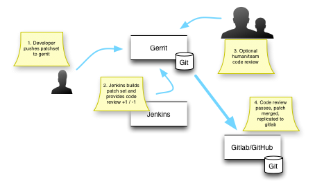
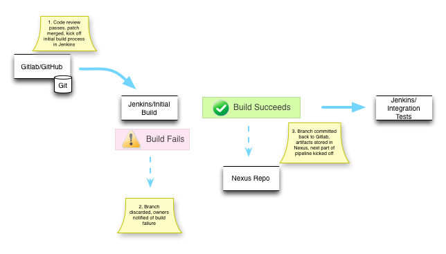
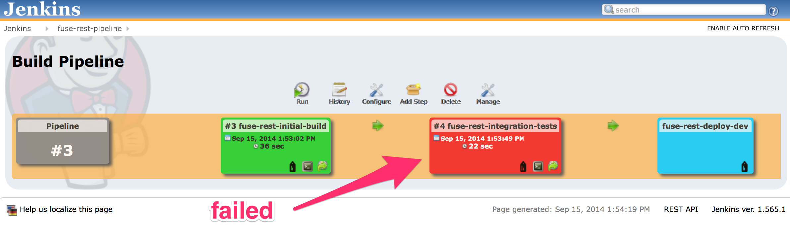
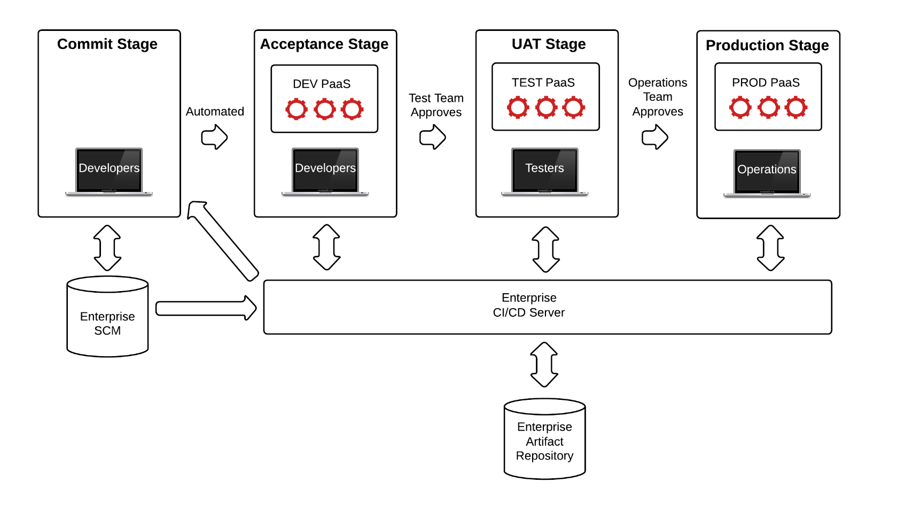
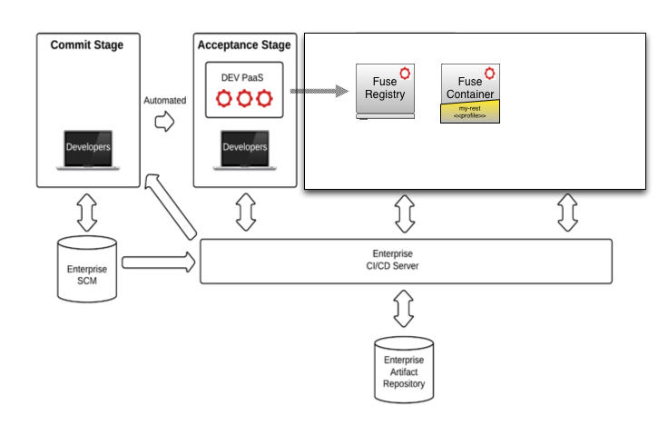

# Continuous Delivery with JBoss Fuse 6.1 and OpenShift Enterprise 2.1

This guide will walk you through a demo of continuous delivery with JBoss Fuse and Red Hat OpenShift PaaS.

The application that we look at in this demo is quite simple and intended to be so because there are already a lot
of moving pieces for the demo. It's the `rest` quickstart from the [JBoss Fuse 6.1][fuse] distro. It has been
slightly modified for the purposes of this demo and lives at [https://github.com/christian-posta/quickstart-fuse-rest.git](https://github.com/christian-posta/quickstart-fuse-rest.git). Some of the pieces that have been added:

* Integration tests module (stubbed out for the moment)
* Added the Fabric8 Maven plugin 

The code from this project is driven through the delivery pipeline as follows.
 
* Code Review
* Initial build for delivery
* Automated Integration tests
* Build Fuse environment on the fly, deploy code and profiles
* Run automated acceptance tests
* Notify QA to promote to shared QA environment
* Run Acceptance tests + manual tests in QA environment
* Notify build and release team to promote to Prod/Staged Prod
* Run acceptance tests (if applicable)

## Code Review
Developers work on code for the project, but there are different roles in terms of who has access to the project.
This is generally set up like an open-source project, but doesn't have to be. Either way, the role of the Code
Review is three things:

1) Ensure patch correctly implements desired functionality, is accompanied by tests, and helps the author understand
any gotchas or clear up assumptions of the code
2) Enforce code quality, standards, conventions, etc
3) Encourage cross pollination of understanding of the code

For this demo, we've chosen the popular Gerrit code review tool. Gerrit-style code reviews add a little more
formality and governance around achieving the above goals. They are different that GitHub-stype pull requests, and the
reader is encouraged to understand how. On large complex opensource projects (OpenStack, Android, etc) or similar 
internal enterprise projects, a more fine grained review process is required. Gerrit can also be integrated with
Jenkins and Gitlab to provide a more feature-filled environment for typical enterprises.

This is a visualization of the interaction between the pieces in the demo:

---

---

When a developer is ready to submit a code change, they submit the code to Gerrit as a "patchset." This patchset is
then scrutinized, reviewed more carefully, and finally voted on by automated builds, team members, and ultimately those 
who have commit authority. See [set-up-gerrit.md](set-up-gerrit.md) for more details on the roles and voting mechanisms
employed for a gerrit patchset.

In the demo, when a patchset is submitted, Jenkins will automatically checkout the change, build it and run unit tests.
If everything looks good, then Jenkins will vote +1 for the change. This can be taken to mean "jenkins found no problems
with the build, unit tests, and anything else it was charged with examining in a first pass". At this point any team
member with +2/commit authority can view the patch and vote. If the patchset gets voted a +2, then the change will
be merged into the master branch. When this happens in the demo, the code will be automatically replicated to a 
read-only repo that's more suitable for browsing code, viewing commits, and filing issues. In this case it's Gitlab,
but we could also have used GitHub as gerrit has good integration with both. Gitlab/GitHub provide a read-only copy
of the authoritative master that's in Gerrit. Jenkins deploy pipeline builds are initiated from the Gitlab repo.

## Code merged, kick off initial build for delivery
Once the code has been merged to the authoritative master, the build pipeline can start. The initial smoke builds done
by jenkins earlier were on the SNAPSHOT code with the patchset applied. Once this patchset has been accepted by the
reviewers, it becomes eligible to be built and deployed. When the code has made it to the authoritative master, we follow 
a continuous-integration style reaction here where the code will be checked out and built again. The big difference 
this time is that since the code is eligible for delivery, we will need to assign a version to it. We branch the code from
Gitlab, assign a version number and proceed. This code will then 
run through unit tests, code style checks, and other quality inspections. If all is good, the code with the new version 
is committed back to the git branch and pushed back to Gitlab, and artifacts are stored into a central artifact repository
(Nexus for this demo, could be file system, Artifactory, etc) and this stage is passed. If this stage has passed successfully, the next stage is initiated: Automated integration tests.

---

---

## Integration tests
An important part of any build pipeline is testing. Without appropriate testing you cannot automate the delivery of
code to production in any sensible way. Although your unit tests should catch any bugs close to the source code,
a larger and more confusing area of bugs lies when you integrate with other systems (inaccurately specified requirements,
environment issues, config changes, network instability, etc,etc). Setting up automated integration tests for your JBoss Fuse integrations is a critical step.

JBoss Fuse uses [Pax Exam](https://ops4j1.jira.com/wiki/display/paxexam/Pax+Exam) for its internal integration testing, but for Fuse 6.2 (and as seen in the community [Fabric8](http://fabric8.io) right now) [Arquillian](http://arquillian.org) is the best option. Arquillian is focused for multi-container technology, while Pax Exam is specifically OSGI testing. There are some examples of setting up Pax Exam and Arquillian tests here:

* [FabricTestSupport.java](https://github.com/fabric8io/fabric8/blob/6.1.x/fabric/fabric-itests/common/src/main/java/io/fabric8/itests/paxexam/support/FabricTestSupport.java) (pax exam, fuse 6.1)
* [ContainerRegistrationTest](https://github.com/fabric8io/fabric8/blob/6.1.x/fabric/fabric-itests/basic/src/test/java/io/fabric8/itests/basic/ContainerRegistrationTest.java) (pax exam, fuse 6.1)
* [ContainerRegistrationTest](https://github.com/fabric8io/fabric8/blob/master/itests/basic/karaf/src/test/java/io/fabric8/itests/basic/karaf/ContainerRegistrationTest.java) (arquillian, fabric8 1.2/fuse 6.2)

In the demo, if any automated integration tests (at the moment, there are no live tests for the demo. It's a place holder 
intended to be filled out) fail, we stop the build pipeline and alert any interested stakeholders.

---

---

## Deploy to OSE/dev

    If you're interested in automating the deployment of your Fuse/Fabric8 projects to OpenShift, this is the build step you should dig into.

To move our code further along in the pipeline, we need to actually deploy it and make sure it works not only with the
code and configuration we've assigned but also within a real (and progressively more production like) environment. 
traditionally, to do this, you would have some kind of shared infrastructure where you deploy code to existing, shared
containers hoping to not blow everything up or step on someone else's toes. Often these types of deployment would have zero
environment configurations where you can deploy and version entire environments (although I've seen some companies do a 
really good job of this). But sharing environments can be a nightmare (as I've also seen some companies do this ;) ) so 
we've [opted to use a PaaS][openshift] to help isolate our dev environments and the builds/testing we do for each deployment.
  
[Trevor Quinn](http://www.linkedin.com/in/trevorquinn) put together this excellent graphic of how OSE environments and a deployment pipeline could look:

---

---

Our demo does something similar, although we only use one OSE environment and try to partition deployments by domain/build number. But for a real deployment, you will most likely have a dev OSE, QA OSE, and production OSE.
 
In the demo, if our initial builds and integration builds pass successfully, we will try to do the following things:

* spin up a new fuse environment on the fly in a "Dev" OSE
* deploy our fuse binaries + fabric profiles to this new environment
* deploy a fuse container and apply our profiles/binaries
* run acceptance tests against this environment

---

---

The Jenkins build itself uses the scripts found in the [ose-scripts](../ose-scripts) directory. To create the OSE
environment, we use the OpenShift REST API. After we've successfully created a new Fuse cartridge in the OSE dev
environment, we capture the gear details (domain, ssh urls, fuse console passwords, etc) and inject them into the
Jenkins build so that we can use them as parameters for kicking off the scripts to build the fabric profiles and
upload them to the fuse gear. For example, here's an example of some of those environment variables that we can use:

    FUSE_ROOT_URL=http://fuse10-dev.ose.pocteam.com/
    FUSE_GEAR_SSH=ssh://54121b79d91cec462a0000bb@fuse10-dev.ose.pocteam.com
    FUSE_CONTAINER_SSH=fuse10-dev.ose.pocteam.com:45556
    FUSE_CONSOLE_USER=admin
    FUSE_CONSOLE_PASSWORD=fZ_WpQGZxddg
    FUSE_ZK_URL=fuse10-dev.ose.pocteam.com:43526
    FUSE_ZK_PASSWORD=fZ_WpQGZxddg
    
We can also log directly into the gear (FUSE_GEAR_SSH) or into the Fuse container itself (FUSE_CONTAINER_SSH). The
rest of the jenkins build will log directly into the FUSE_CONTAINER_SSH and spin up a new container with the `my-rest`
profile. This profile was automatically generated using the `fabric8:deploy maven goal`. See the Jenkins job for
`fuse-rest-deploy-dev`.

 
## Dev Acceptance tests
After we've deployed our environment (OSE + Fuse + our integrations), we'll want to run some automated acceptance tests.
These tests will be the gate keeper to moving to the next environment (QA for example). This automated acceptance tests
can be developed using any testing framework (Cucumber, FitNesse, etc) but using good old JUnit to automate these is
an acceptable solution too. 

## Migration to other environments
If these acceptance tests pass, then we do the following things:

* We should extract the profiles associated with this application from Fuse/Fabric8. This will allow us to easily migrate our deployment to the next stage. All profiles are kept in git so we basically do a git clone 
* We zip up the profiles associated with our application
* We push the zip artifact up to our central artifact repository

Pushing the profiles up to our artifact repository allows us to version our deployments and migrate them. Any ideal build process will build the binaries _once_ and migrate them exactly to other environments (and change configurations, depending on env. But also note, these configurations are _also_ versioned... everything is versioned!!!)

The zip files can then be pulled down and merged into a QA fuse deployment (or PROD). Since fuse by default pulls binaries down from the artifact repository, you have a fully automated and auditable trace of how code gets from one environment to another. 

[fuse]: http://www.jboss.org/products/fuse/overview/
[openshift]: https://www.openshift.com
