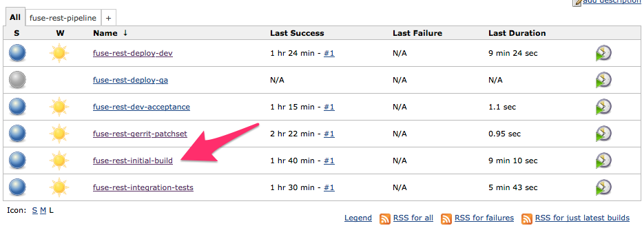

# Continuous Delivery with JBoss Fuse 6.1 and OpenShift Enterprise 2.1

This guide will walk you through a demo of continuous delivery with JBoss Fuse and Red Hat OpenShift PaaS.

The application that we look at in this demo is quite simple and intended to be so because there are already a lot
of moving pieces for the demo. It's the `rest` quickstart from the [JBoss Fuse 6.1][fuse] distro. It has been
slightly modified for the purposes of this demo and lives at [https://github.com/christian-posta/quickstart-fuse-rest.git](https://github.com/christian-posta/quickstart-fuse-rest.git). Some of the pieces that have been added:

* Integration tests module (stubbed out for the moment)
* Added the Fabric8 Maven plugin 

The code from this project is driven through the delivery pipeline as follows.
 
* Code Review (automated + human)
* Initial build
* Automated integration tests (this is stubbed out for the demo, but placeholder and mvn module exist)
* Build Fuse environment on the fly, deploy code and profiles to OpenShift Enterprise
* Run automated acceptance tests (stubbed out for the demo)
* Deploy fuse profiles to Enterprise Artifact Repository
* Notify QA to promote to shared QA environment
* Run Acceptance tests + manual tests in QA environment
* Notify build and release team to promote to Prod/Staged Prod
* Run acceptance tests (if applicable)

## Code Review
Developers work on code for the project, but there are different roles in terms of who has access to the project.
This is generally set up like an open-source project, but doesn't have to be. Either way, the role of the Code
Review is three things:

1) Ensure patch correctly implements desired functionality, is accompanied by tests, and helps the author understand
any gotchas or clear up assumptions of the code
2) Enforce code quality, standards, conventions, etc
3) Encourage cross pollination and understanding of the code

For this demo, we've chosen the popular Gerrit code review tool. Gerrit-style code reviews add a little more
formality and governance around achieving the above goals. They are different than GitHub-style pull requests, and the
reader is encouraged to understand how. On large complex opensource projects (OpenStack, Android, etc) or similar 
internal enterprise projects, a more fine grained review process is required. Gerrit can also be integrated with
Jenkins and Gitlab to provide a more feature-filled environment for typical code reviews.

This is a visualization of the interaction between the pieces in the demo:

---

---

When you make a change to the project and push it to gerrit via the `refs/for/master` branch, you should
see that Jenkins checked out the code, built it, and added a +1 to the Code Review of the patchset. (actually
the build is stubbed out, so it won't really do a mvn build, but it does initiate the build job and vote on the
patchset)

Example, let's make a change to the readme.md of the project and push to gerrit for review to see if jenkins
also does its code review:

Start by changing the `README.md` file of the project. Change something like "Author: " from "Fuse team" to your name.
Then save it and commit to git:

    git commit -a -m 'changed author'
    
At this point, we should make sure that the gerrit commit hoook added a `change-id` as this is how gerrit groups
changes:

    
    ceposta@postamachat(gerrit-quickstart-fuse-rest (master)) $ git log -n 1
    commit d0d35198ea582beba091f31ff3d5f0deb63aac8c
    Author: Administrator <admin@company.com>
    Date:   Wed Sep 17 09:58:05 2014 -0700
    
        changed author
        
        Change-Id: I5bf8c63b91b198b1446ef472b33ce08a0636b42e
    (END) 
    
    
So now we should push this commit to gerrit:

    ceposta@postamachat(gerrit-quickstart-fuse-rest (master)) $ git push gerrit HEAD:refs/for/master
    Counting objects: 14, done.
    Delta compression using up to 8 threads.
    Compressing objects: 100% (3/3), done.
    Writing objects: 100% (3/3), 338 bytes | 0 bytes/s, done.
    Total 3 (delta 2), reused 0 (delta 0)
    remote: Resolving deltas: 100% (2/2)
    remote: Processing changes: new: 1, refs: 1, done    
    remote: 
    remote: New Changes:
    remote:   http://localhost:8080/1
    remote: 
    To http://admin@ceposta-public:49176/quickstart-fuse-rest.git
     * [new branch]      HEAD -> refs/for/master
     
At this point, we should see a new patchset in gerrit:

Also note that little "+1" in the "CR" column. That means Jenkins did its thing. We can click on the changeset and
see it more clearly:

---

---

---

Also note that little "+1" in the "CR" column. That means Jenkins did its thing. We can click on the changeset and
see it more clearly:

At this point any team member with +2/commit authority can view the patch and vote. If the patchset gets voted a +2, 
then the change will be merged into the master branch. When this happens in the demo, the code will be automatically
replicated to a read-only repo that's more suitable for browsing code, viewing commits, and filing issues. In this case
it's Gitlab, but we could also have used GitHub as gerrit has good integration with both. Gitlab/GitHub provide a
read-only copy of the authoritative master that's in Gerrit. Jenkins deploy pipeline builds are initiated from the Gitlab
repo.

## Code merged, kick off initial build for delivery
Once the code has been merged to the authoritative master, the build pipeline can start. The initial smoke builds done
by jenkins earlier were on the SNAPSHOT code with the patchset applied. Once this patchset has been accepted by the
reviewers, it becomes eligible to be built and deployed. When the code has made it to the authoritative master, we follow 
a continuous-integration style reaction here where the code will be checked out and built following this pipeline:

---

---

The big difference 
this time is that since the code is eligible for delivery, we will need to assign a version to it. We branch the code from
Gitlab, assign a version number and proceed. 

    git checkout -b quickstart-fuse-rest-1.0.0
    versions:set -DnewVersion=1.0.0

This code will then 
run through unit tests, code style checks, and other quality inspections. If all is good, the code with the new version 
is committed back to the git branch and pushed back to Gitlab, and artifacts are stored into a central artifact repository
(Nexus for this demo, could be file system, Artifactory, etc) and this stage is passed. If this stage has passed
successfully, the next stage is initiated: Automated integration tests.

    git commit -a -m 'new release candidate'
    git push http://host/root/quickstart-fuse-rest.git quickstart-fuse-rest-1.0.0

---

---

## Integration tests
An important part of any build pipeline is testing. Without appropriate testing you cannot automate the delivery of
code to production in any sensible way. Although your unit tests should catch any bugs close to the source code,
a larger and more confusing area of bugs lies when you integrate with other systems (inaccurately specified requirements,
environment issues, config changes, network instability, etc,etc). Setting up automated integration tests for your JBoss Fuse integrations is a critical step.

JBoss Fuse uses [Pax Exam](https://ops4j1.jira.com/wiki/display/paxexam/Pax+Exam) for its internal integration testing, but for Fuse 6.2 (and as seen in the community [Fabric8](http://fabric8.io) right now) [Arquillian](http://arquillian.org) is the best option. Arquillian is focused for multi-container technology, while Pax Exam is specifically OSGI testing. There are some examples of setting up Pax Exam and Arquillian tests here:

* [FabricTestSupport.java](https://github.com/fabric8io/fabric8/blob/6.1.x/fabric/fabric-itests/common/src/main/java/io/fabric8/itests/paxexam/support/FabricTestSupport.java) (pax exam, fuse 6.1)
* [ContainerRegistrationTest](https://github.com/fabric8io/fabric8/blob/6.1.x/fabric/fabric-itests/basic/src/test/java/io/fabric8/itests/basic/ContainerRegistrationTest.java) (pax exam, fuse 6.1)
* [ContainerRegistrationTest](https://github.com/fabric8io/fabric8/blob/master/itests/basic/karaf/src/test/java/io/fabric8/itests/basic/karaf/ContainerRegistrationTest.java) (arquillian, fabric8 1.2/fuse 6.2)

In the demo, if any automated integration tests (at the moment, there are no live tests for the demo. It's a place holder 
intended to be filled out) fail, we stop the build pipeline and alert any interested stakeholders.

---

---

## Deploy to OSE/dev

    If you're interested in automating the deployment of your Fuse/Fabric8 projects to OpenShift, this is the build step you should dig into.

To move our code further along in the pipeline, we need to actually deploy it and make sure it works not only with the
code and configuration we've assigned but also within a real (and progressively more production like) environment. 
Traditionally, to do this, you would have to procure some kind of shared infrastructure where you deploy code to existing, servers hoping to not blow everything up or step on someone else's toes. Often these types of deployment would have zero
environment configurations where you can deploy and version entire environments (although I've seen some companies do a 
really good job of this). But sharing environments can be a nightmare (as I've also seen some companies do this ;) ) so 
we've [opted to use a PaaS][openshift] to help isolate and automate our dev environments and the builds/testing we do for each deployment. The benefits are these:

    * isolation from other environments
    * don't need to plan ahead of time to provision, can spin up on the fly
    * can fully tests that your environment is set up correctly (wink, wink... DevOps??)
  
[Trevor Quinn](http://www.linkedin.com/in/trevorquinn) put together this excellent graphic of how OSE environments and a deployment pipeline could look:

---

---

Our demo does something similar, although we only use one OSE environment and try to partition deployments by domain/build number. But for a real deployment, you will most likely have a dev OSE, QA OSE, and production OSE.
 
In the demo, if our initial builds and integration builds pass successfully, we will try to do the following things:

### spin up a new fuse environment on the fly in a "Dev" OSE

We use the OSE REST api to do this. See the docs here: [http://openshift.github.io/documentation/rest_api/rest-api-1-6.html](http://openshift.github.io/documentation/rest_api/rest-api-1-6.html)

After the Fuse environment is created, we inject the necessary environment variables back into the workspace. For example,
when you create a new Fuse app, the DNS name, Console admin and passwords, ZK urls, etc are spit out to the console. We
capture these and inject. For example:

    FUSE_ROOT_URL=http://fuse10-dev.ose.pocteam.com/
    FUSE_GEAR_SSH=ssh://54121b79d91cec462a0000bb@fuse10-dev.ose.pocteam.com
    FUSE_CONTAINER_SSH=fuse10-dev.ose.pocteam.com:45556
    FUSE_CONSOLE_USER=admin
    FUSE_CONSOLE_PASSWORD=fZ_WpQGZxddg
    FUSE_ZK_URL=fuse10-dev.ose.pocteam.com:43526
    FUSE_ZK_PASSWORD=fZ_WpQGZxddg
    
These variables are now available within our build environment.

You can check out the scripts for this step here:

    * [ose-scripts/create_ose_env.sh](../ose-scripts/create_ose_env.sh)
    * [ose-scripts/check_app_exists.py](../ose-scripts/check_app_exists.py)
    * [ose-scripts/create_new_app.sh](../ose-scripts/create_new_app.sh)
    
### deploy our fuse binaries + fabric profiles to this new environment
Once the Fuse environment is spun up, we will use the [Fabric8 maven plugin](http://fabric8.io/gitbook/mavenPlugin.html) 
plugin to build our binaries as well as our [Fuse profiles](http://fabric8.io/gitbook/profiles.html). Once these profiles are built, we'll push them up to the [Fuse registry](http://fabric8.io/gitbook/registry.html) with this command:

    fabric8:deploy -Dfabric8.jolokiaUrl=${FUSE_ROOT_URL}/jolokia -Dfabric8.serverId=fabric8.upload.repo -Dmaven.test.skip=true -DfailIfNoTests=false -s ${WORKSPACE}/.env-scripts/jenkins-docker/maven/settings.xml
    
    

### deploy a fuse container and apply our profiles/binaries
Once we have our profiles deployed to our Fuse registry we can now use Fuse to deploy the profile the way you would with any Fuse Fabric/Fabric8 deployment. However, since this is dev, we will just automate this piece also using this script here:

See [this script to do that.](../ose-scripts/create_fuse_container.sh)

---

---

 
## Dev Acceptance tests
After we've deployed our environment (OSE + Fuse + our integrations), we'll want to run some automated acceptance tests.
These tests will be the gate keeper to moving to the next environment (QA for example). This automated acceptance tests
can be developed using any testing framework (Cucumber, FitNesse, etc) but using good old JUnit to automate these is
an acceptable solution too. 

If these acceptance tests pass, then we do the following things:

* We  extract the profiles associated with this application from Fuse/Fabric8. This will allow us to easily migrate our deployment to the next stage. All profiles are kept in git so we basically do a git clone 
* We zip up the profiles associated with our application
* We push the zip artifact up to our central artifact repository

## Migration to other environments

Pushing the profiles up to our artifact repository allows us to version our deployments and migrate them. Any ideal build process will build the binaries _once_ and migrate them exactly to other environments (and change configurations, depending on env. But also note, these configurations are _also_ versioned... everything is versioned!!!)

The zip files can then be pulled down and merged into a QA fuse deployment (or PROD). Since fuse by default pulls binaries down from the artifact repository, you have a fully automated and auditable trace of how code gets from one environment to another. 

[fuse]: http://www.jboss.org/products/fuse/overview/
[openshift]: https://www.openshift.com
