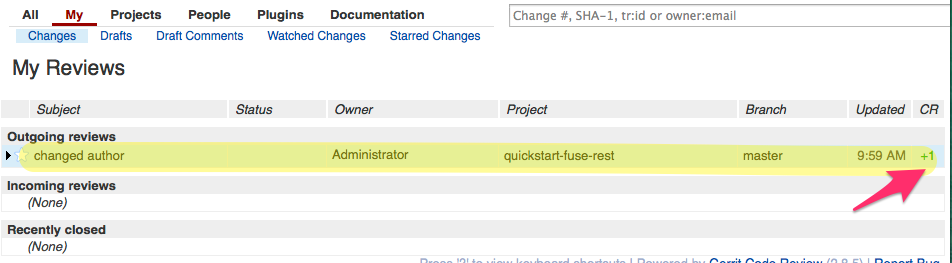
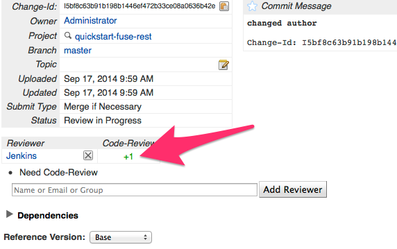

# Setting up Gerrit for the Continuous Delivery Demo
We use docker containers for all of the continuous deliver pieces, so follow the first section on setting up the
Docker container on your host. Docker isn't required if you wish to manually set up an environment somewhere else.

## Set up Docker container
For this container, we're using an image from the scripts in this project. So you'll need to have this project checked
out into a directory from now on referred to $PROJ_ROOT.

To build the Docker image, navigate to the `gerrit-docker` folder:

    cd $PROJ_ROOT/gerrit-docker
    
Then build the image using `gerrit` as the image name:

    docker build -t fabric8:gerrit .
    
Now you should have an image of the gerrit installation we're going to use.

Run the container with this command:

    docker run -itdP --env GITLAB_USER=root --env GITLAB_PASSWORD=redhat01 --env GITLAB_PROJ_ROOT=root --name gerrit --link gitlab:gitlab fabric8:gerrit
    
Note we link to the `gitlab` container, so this container must have been installed first. The username/password are
the credentials we set when creating our gitlab account. [See the GitLab setup instructions for more](set-up-gitlab.md).

Now you can run the following command to see where on the host Gerrit HTTP listener is installed:

    docker port gerrit 8080
    
## Required manual steps
Here are the manual steps we need to take to set up gerrit.

Gerrit does have an SSH admin interface and we do use that to automate setting everything else up, but you 
have to start off by creating the admin account and assiging an SSH key to it (the SSH keys must be the ones
from this project for the demo to work).
    
## Set up Gerrit Admin account

The first person to log into gerrit becomes the administrator. Since we've set up Gerrit to be in developer mode we
won't use any fancy SSO signin. To see more about the config [checkout the Readme.md from the dockerfile](../gerrit-docker/Readme.md). You can "become" a specific user in this development mode, and the first account we
"become" will be the admin account. So click the "Become" link in the top right-hand corner. Then click
"New Account" under register:

---

---

Now you'll need to enter these fields in this order 

1. Register New Email: admin@company.com
2. Full Name (click Save Changes): Administrator
3. Enter a Username (click Select Username): admin

Since we're going to use a gerrit-jenkins integration to help review the patch files, and we'll need some automated setup , we're going to want to set an administrator SSH. This SSH key can be used for committing code as well as administration functions.

Copy the ssh key from the $PROJ_ROOT/gerrit-docker/ssh-keys/gerrit-admin.pub key. The private key will be used to 
automate some scripting pieces that will setup the gerrit-jenkins relationship (see below).

Click the _continue_ link at the bottom left hand side.

### Set up HTTP password
Before you keep going, you should set up an HTTP password so we can use the HTTP url with gerrit (of course this
is just for the demo. You __should__ use the SSH access in a real environment).

To do this, Click on your name in the upper right hand and select "settings"

On the left-hand side, you should see "HTTP Password" click that and generate a password:

---

---

Now the Admin account is all setup...

### Set up Jenkins Account (automated)

We can also set up the jenkins account on gerrit and alter the project permissions so that when we commit a new
patchset for a project, jenkins can check it out and do a sanity build on it and provide its feedback to gerrit.

This part is automated.

There is [a script in the gerrit-docker folder named conf-jenkins-user.sh](../gerrit-docker/conf-jenkins-user.sh) that
you should run after setting up the Admin account which will automatically setup the jenkins user (if doesn't exist) and update the project settings to allow jenkins to monitor gerrit for changes. This script depends on the `admin`
username and the `gerrit-admin` private key that we set up in the previous step, so please verify everything was 
set up correctly. Now run:

    $PROJ_ROOT/conf-jenkins-user.sh "hostname" "gerrit-ssh-port"
    
`hostname` is going to be where you're running your docker container, `gerrit-ssh-port` is going to be the output of
    
    docker port gerrit 29418

Notes for manual set up:
If you want jenkins to participate in the voting/code review, you should add a jenkins user with these details:

Full Name: Jenkins
username: jenkins
email: jenkins@jenkins.org
SSH-key: the public key from jenkins-gerrit project

You should also log in as admin and update the All-Projects access to allow Non-Interactive
users to modify refs/* and label-code-reviews for -1..+1

## Prep the quickstart-fuse-rest project

Next we need to get the project set up. So just like we created a new project (empty one) on gitlab, we'll do the same
here for Gerrit. Click on "Projects" and then "Create New Project" The name of the project must match the name we
gave to the project in GitLab (because that's how the replication from Gerrit to GitLab happens) and we MUST use the name
__quickstart-fuse-rest__ because that's what's used in the Jenkins builds for the demo.

---

---

Now we need to import some code!! We'll check out the quickstart-fuse-rest code from GitHub:

    $ git clone https://github.com/christian-posta/quickstart-fuse-rest.git
    $ cd quickstart-fuse6.1-rest
    
Then we'll need to add the gerrit url as a remote (note substitute in your own host/port names):

    $ git remote add gerrit http://admin@ceposta-public:49166/quickstart-fuse-rest.git
    

Note you'll need to get the HTTP url from here:

---

---

Now we need to configure the git-config with the same values we have in our Gerrit installation:

    git config user.name "Administrator"
    git config user.email "admin@company.com"
    
Then we have to get the commit-msg hook that'll use for generating Change-Ids (which is what gerrit uses for tracking
changes:

    curl -Lo .git/hooks/commit-msg http://ceposta-public:49157/tools/hooks/commit-msg
    chmod +x .git/hooks/commit-msg
        
Note, the URL above to grab the commit-msg is the location of your gerrit installation and "/tools/hooks/commit-msg"

    NOTE: You may also want to take a look at git-review which is a git plugin that helps interact with gerrit [git-review](http://www.mediawiki.org/wiki/Gerrit/git-review) This can take care of setting up the commit hooks and set up the right branches for review

Now we should be ready to push to master (we'll pull first to rebase what's already in gerrit)

    git pull gerrit master
    git push gerrit master
    
For initial import, we'll push to _master_, however, for code reviews, we push to this branch (as we'll see in the
demo)

    git push gerrit HEAD:refs/for/master
    
    
This will cause the code review to kick in.

## Verify replication happened correctly
At this point we have our quickstart-fuse-rest application installed into Gerrit, and since gerrit does repplication
to GitLab, we should see the same code in Gitlab as well. If this happened, everything is working correctly so far.

For me, the path to my Gitlab project is here:
    
    http://ceposta-public:49164/root/quickstart-fuse-rest/tree/master
    
Yours will be wherever you set up gitlab using the Gitlab docker container [as described in setting up Gitlab](set-up-gitlab.md)

## Verify jenkins code-review happened correctly
When you make a change to the project and push it to gerrit via the `refs/for/master` branch, you should
see that Jenkins checked out the code, built it, and added a +1 to the Code Review of the patchset. (actually
the build is stubbed out, so it won't really do a mvn build, but it does initiate the build job and vote on the
patchset)

Example, let's make a change to the readme.md of the project and push to gerrit for review to see if jenkins
also does its code review:

Start by changing the `README.md` file of the project. Change something like "Author: " from "Fuse team" to your name.
Then save it and commit to git:

    git commit -a -m 'changed author'
    
At this point, we should make sure that the gerrit commit hoook added a `change-id` as this is how gerrit groups
changes:

    
    ceposta@postamachat(gerrit-quickstart-fuse-rest (master)) $ git log -n 1
    commit d0d35198ea582beba091f31ff3d5f0deb63aac8c
    Author: Administrator <admin@company.com>
    Date:   Wed Sep 17 09:58:05 2014 -0700
    
        changed author
        
        Change-Id: I5bf8c63b91b198b1446ef472b33ce08a0636b42e
    (END) 
    
    
So now we should push this commit to gerrit:

    ceposta@postamachat(gerrit-quickstart-fuse-rest (master)) $ git push gerrit HEAD:refs/for/master
    Counting objects: 14, done.
    Delta compression using up to 8 threads.
    Compressing objects: 100% (3/3), done.
    Writing objects: 100% (3/3), 338 bytes | 0 bytes/s, done.
    Total 3 (delta 2), reused 0 (delta 0)
    remote: Resolving deltas: 100% (2/2)
    remote: Processing changes: new: 1, refs: 1, done    
    remote: 
    remote: New Changes:
    remote:   http://localhost:8080/1
    remote: 
    To http://admin@ceposta-public:49176/quickstart-fuse-rest.git
     * [new branch]      HEAD -> refs/for/master
     
At this point, we should see a new patchset in gerrit:

Also note that little "+1" in the "CR" column. That means Jenkins did its thing. We can click on the changeset and
see it more clearly:

---

---

---

Also note that little "+1" in the "CR" column. That means Jenkins did its thing. We can click on the changeset and
see it more clearly:

## Random Gerrit Notes: Roles, Reviews, Topics

### Gerrit Topcis:
With gerrit changes are slightly different than with PR because you typically have a single commit to review. However, you can organize multiple commits into “topics” by pushing to 
    
    HEAD:refs/for/master%topic=topic-name

### Gerrit Reviewers
To add a reviewer, add their email to the `r` param:

    HEAD:refs/for/master%topic=first-topic,r=christian.posta@gmail.com

### Gerrit Roles

Life of a patch: http://source.android.com/source/life-of-a-patch.html

* Contributor - an internal or external member of the team who uploads a commit for review
* Reviewer - Any internal or external member of the team who is allowed to post comments on a change and provide score
* Committer - A senior team member allowed to grant a veto or approve, submit, and merge a change
* Build - Batch user (jenkins?) allowed to fetch and provide automated review

### Reviews

* Review/-2 a committer has fundamental reasons for opposing the merge veto cannot be cancelled by another reviewer, and will block the change
* Review/-1 not a blocker for merge, but is a negative score; indication more work is needed to bring into acceptable state
* Review/0  comments
* Review/+1 positive score, no problems found, though reserved for non-committers (reviewers)
* Review/+2 committers think the code should be merged

### Amending code under review

Can click the git link to download the actual change set and start from there:

    git fetch http://ceposta-public:49157/quickstart-fuse-rest refs/changes/01/1/1 && git checkout FETCH_HEAD

Can do this in the same project as master because it checks out the change for you in place. Then make changes, and do a commit —amend:

    git commit --amend

This will cause the commit to use the same change-id (as that’s how commits are tracked)

## What's Next?
You can [go right to the Demo](demo.md) or you can [set up Nexus](set-up-nexus.md) since that's the next container
that should be set up to do the demo.