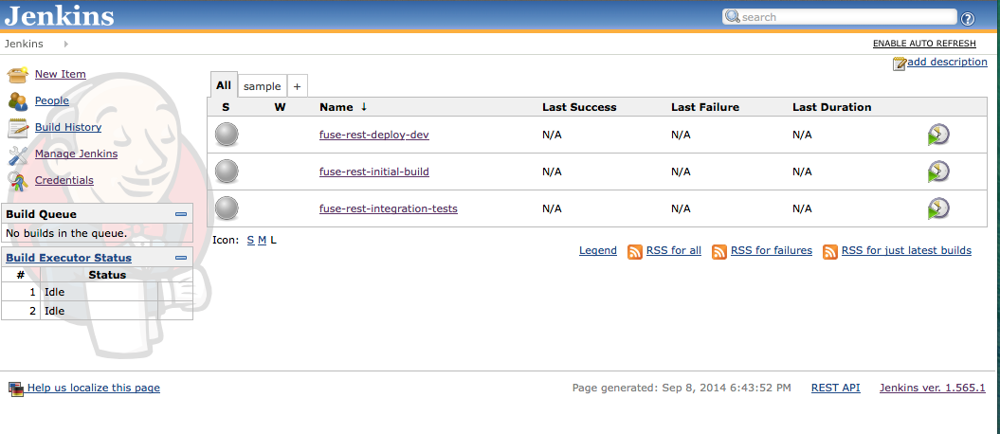

# Setting up Jenkins for the Continuous Delivery Demo
We use docker containers for all of the continuous deliver pieces, so follow the first section on setting up the
Docker container on your host. Docker isn't required if you wish to manually set up an environment somewhere else.

## Set up Docker container
For this container, we're using an image from the scripts in this project. So you'll need to have this project checked
out into a directory from now on referred to $PROJ_ROOT.

To build the Docker image, navigate to the `gerrit-docker` folder:

    cd $PROJ_ROOT/jenkins-docker
    
Then build the image using `gerrit` as the image name:

    docker build -t myjenkins .
    
Now you should have an image of the gerrit installation we're going to use.

Run the container with this command:

    docker run -itdP --name jenkins --link gitlab:gitlab --link nexus:nexus myjenkins
    
Note we link to the `gitlab` and `nexus` containers, so these containers must have been installed first (the correct
order, as illustrated on the root Readme.md of this project is "Gitlab" then "Nexus".

[See the GitLab setup instructions for more](set-up-gitlab.md).
[See the Nexus setup instructions for more](set-up-nexus.md).

Now you can run the following command to see where on the host Gerrit HTTP listener is installed:

    docker port jenkins 8080
    
## Running a build
At this point you should be able to navigate to the Jenkins page (as exposed on the host and the port from above)
and inspect the build jobs. For example, from my box, the URL looks like this: http://ceposta-public:49161
 
You should have a pipeline and build jobs already configured and ready to go

---

]

---

You can explore the projects and see how they're set up.

To run a build, click `fuse-rest-initial-build` link and then `Build with Paramters` link off to the left.
You can choose to go with the default params (`1.0`) for this project. This signifies the "Major Version" of the
build, and Jenkins will substitute the rest of the data. As long as this build runs fine you should be all set.

Note, we'll go through the entire deployment pipeline in [the demo guide](demo.md).