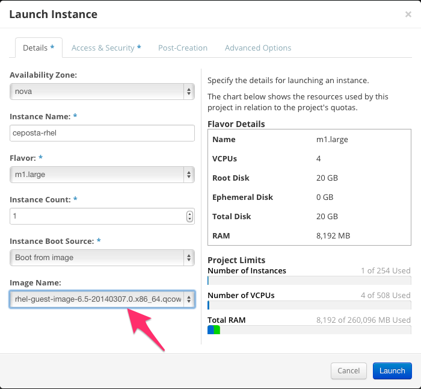

# Provisioning a RHEL machine in OpenStack

Log in to your OpenStack installation (for this demo, I'm using Red Hat's public OpenStack). 

I have used an Image based on RHEL 6.5 (rhel-guest-image-6.5-20140307.0.x86_64.qcow2 to be exact).

Example:

---

---

Make sure to appropriately assign any floating IPs your instances may require.

If using RHEL, make sure to subscribe it to the RHN appropriately.

